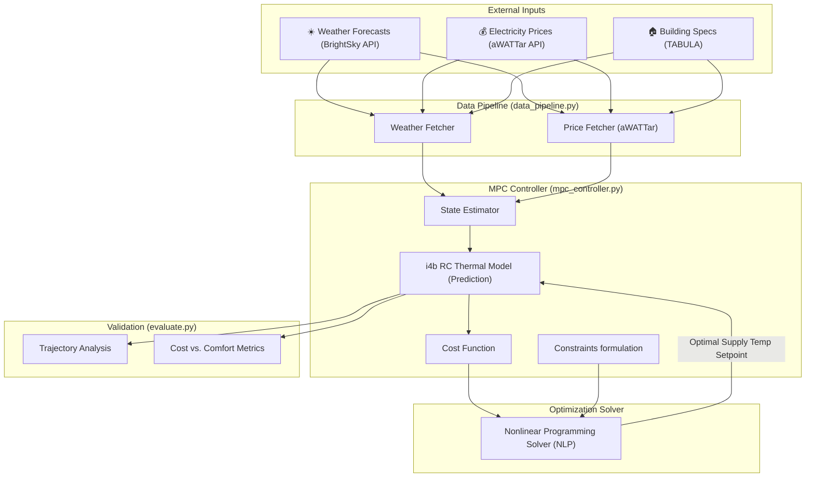

# 🏠 Heat Pump MPC Control System: Detailed Architecture

This document provides a comprehensive technical breakdown of the Model Predictive Control (MPC) based heat pump control system. The system integrates the **i4b (Intelligence for Buildings)** physics-based thermal simulation framework with an **Optimization Solver** (e.g., CasADi, GEKKO, or SciPy) to create an energy-efficient, cost-aware building controller.

---

## 1. Executive Summary

Traditional heat pump controllers (like heating curves) rely on simple linear relationships between outdoor temperature and supply temperature. They are **reactive**. 

Our system is **proactive**. By using Model Predictive Control (MPC), the controller optimizes over a receding prediction horizon to:
1.  **Pre-heat** the building when electricity prices are low.
2.  **Store energy** in the building's thermal mass.
3.  **Plan ahead** using weather forecasts and day-ahead market prices.
4.  **Balance** comfort (temperature) against cost and equipment wear (cycling) by solving a constrained optimization problem.

---

## 2. System Architecture Diagram

---

## 3. Component Explanation

### 3.1 The Simulation Engine (i4b)
We use the **i4b** (Intelligence for Buildings) library. It provides high-fidelity **RC-network (Resistance-Capacitance)** models.
*   **Physics-based**: It models heat transfer through walls, windows, and air.
*   **TABULA Database**: Includes 31 validated building models for Germany, ranging from unrenovated 1919 houses to modern KfW-standard 2016+ homes.
*   **State Prediction**: Used within the MPC horizon to predict future thermal states based on control inputs and weather disturbances.

### 3.2 The Data Pipeline (`data_pipeline.py`)
This module feeds the "knowledge" into the optimizer:
*   **BrightSky API**: Fetches real-time and historical weather from the German Weather Service (DWD). Key parameters: Ambient temperature, Solar irradiance, and Cloud cover.
*   **aWATTar API**: Fetches day-ahead electricity prices from `https://api.awattar.at/v1/marketdata`. This provides energy prices from the current time up to 24 hours into the future, enabling the MPC to perform cost minimization over the prediction horizon.
*   **Synthetic Generator**: Provides realistic fallback data for offline testing.

### 3.3 The MPC Optimizer (`mpc_controller.py`)
This is the "brain". It formulates an optimal control problem at every time step over a predefined prediction horizon (e.g., 24 hours).
*   **Optimization Formulation**: Translates the dynamic RC model into algebraic/differential constraints.
*   **Receding Horizon Control**: Solves for the optimal control sequence over the horizon, applies the first control action, and repeats the process at the next time step.

---

## 4. System States

The system state tracks the internal thermodynamics of the building at each timestep:

| Category | Feature | Explanation |
|---|---|---|
| **Thermal State** | T_room, T_wall, T_ret | Temperatures of the air, wall mass, and return water. |
| **External** | T_amb, Q_gains | Outdoor temperature and internal gains (human/appliance heat). |
| **Goal** | T_setpoint | The target temperature the user wants. |
| **Market** | Price | Current and predicted electricity cost (€/kWh) from aWATTar. |
| **System** | Compressor State | Current status of the heat pump compressor (to penalize switching). |

---

## 5. Control Variables (Actions)

The optimizer computes a continuous sequence of controls:
*   **Supply Temperature Setpoint** or **Thermal Power Input**: The continuous value between `20°C` and `65°C` (or thermal kW).
*   Higher temperatures deliver more heat to the room but reduce the **COP (Coefficient of Performance)** of the heat pump.

---

## 6. The Objective Function (Cost Function)

The MPC solves a multi-objective optimization problem to minimize the total cost over the prediction horizon $N$:

$$\min_{u} \sum_{k=0}^{N-1} \left( w_1 \cdot J_{cost}(k) + w_2 \cdot J_{comfort}(k) + w_3 \cdot J_{cycling}(k) \right)$$

1.  **Electricity Cost ($J_{cost}$)**:
    *   $\text{Energy Consumed} \times \text{Spot Price (aWATTar)}$.
    *   Forces the optimizer to pre-heat during cheap hours.
2.  **Thermal Comfort ($J_{comfort}$)**:
    *   Uses slack variables to penalize deviations outside the comfort band (e.g., 20°C–23°C).
    *   Soft constraints are used to ensure the optimization problem remains feasible even in extreme weather.
3.  **Compressor Cycling ($J_{cycling}$)**:
    *   Penalty on $\Delta u_k$ (change in control input) to prevent rapid compressor switching, reducing wear and tear.

---

## 7. Algorithms & Solvers

*   **MPC Formulation**: Linearized or non-linear Model Predictive Control, depending on the COP modeling of the heat pump.
*   **Solvers**: 
    *   **CasADi / GEKKO**: Tools for formulating the algebraic/differential equations.
    *   **IPOPT**: Non-linear programming solver.
    *   **OSQP**: Quadratic programming solver (if the model is linearized).
*   **Horizon**: A 24-hour prediction horizon matching the aWATTar price availability.

---

## 8. Development Workflow

1.  **Configure**: Set building type (e.g., renovated 1980s SFH) and MPC horizon in `config.py`.
2.  **Install**: `pip install -r requirements.txt`.
3.  **Run MPC**: Execute `python run_mpc.py`.
4.  **Evaluate**: Run `python evaluate.py`. This generates plots showing how the MPC leveraged the aWATTar price curves and thermal mass to optimize operations.

---

## 9. Conclusion

This architecture bridges the gap between static engineering (physics) and dynamic optimization. By leveraging the validated thermal models of **i4b**, the day-ahead pricing from **aWATTar**, and robust **MPC Solvers**, we create a controller capable of optimal energy cost savings while strictly adhering to occupant comfort and hardware constraints.
