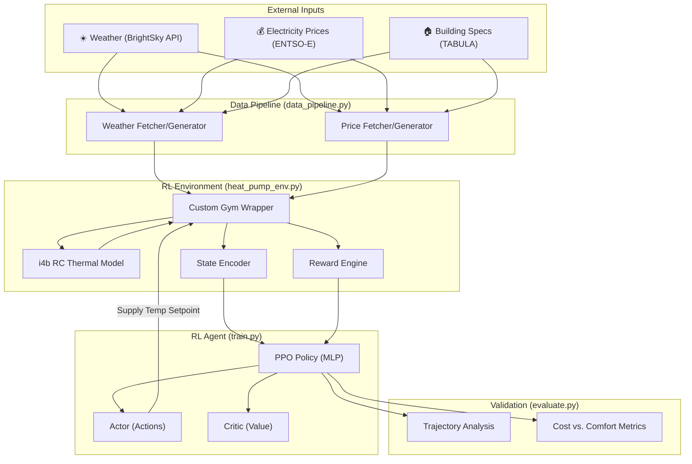

# 🏠 Heat Pump ML Control System: Detailed Architecture

This document provides a comprehensive technical breakdown of the Reinforcement Learning (RL) based heat pump control system. The system integrates the **i4b (Intelligence for Buildings)** physics-based thermal simulation framework with **Stable-Baselines3 (PPO)** to create an energy-efficient, cost-aware building controller.

---

## 1. Executive Summary

Traditional heat pump controllers (like heating curves) rely on simple linear relationships between outdoor temperature and supply temperature. They are **reactive**. 

Our system is **proactive**. By using Reinforcement Learning, the controller learns to:
1.  **Pre-heat** the building when electricity prices are low.
2.  **Store energy** in the building's thermal mass.
3.  **Plan ahead** using weather forecasts.
4.  **Balance** comfort (temperature) against cost and equipment wear (cycling).

---

## 2. System Architecture Diagram

---

## 3. Component Explanation

### 3.1 The Simulation Engine (i4b)
We use the **i4b** (Intelligence for Buildings) library. It provides high-fidelity **RC-network (Resistance-Capacitance)** models.
*   **Physics-based**: It models heat transfer through walls, windows, and air.
*   **TABULA Database**: Includes 31 validated building models for Germany, ranging from unrenovated 1919 houses to modern KfW-standard 2016+ homes.
*   **ODE Solver**: Uses `scipy.integrate` (LSODA) to solve the underlying differential equations of building thermodynamics.

### 3.2 The Data Pipeline (`data_pipeline.py`)
This module feeds the "knowledge" into the agent:
*   **BrightSky API**: Fetches real-time and historical weather from the German Weather Service (DWD). Key parameters: Ambient temperature, Solar irradiance, and Cloud cover.
*   **ENTSO-E API**: Connects to the European electricity market to fetch "Day-Ahead" spot prices.
*   **Synthetic Generator**: Provides realistic fallback data for offline training, mimicking the "Duck Curve" of the German electricity market.

### 3.3 The Custom Environment (`heat_pump_env.py`)
This is the "brain" interface. It wraps i4b into a **Gymnasium** environment.
*   **Normalization**: It scales raw inputs (like 5000 Watts) into small ranges suitable for Neural Networks.
*   **History Tracking**: It remembers if the compressor was on in the previous step to penalize rapid switching.

---

## 4. State Space (Observations)

The agent sees **16 dimensions** at every 15-minute timestep:

| Index | Category | Feature | Explanation |
|---|---|---|---|
| 0-2 | **Thermal State** | T_room, T_wall, T_ret | Temperatures of the air, wall mass, and return water. |
| 3-4 | **External** | T_amb, Q_gains | Outdoor temperature and internal gains (human/appliance heat). |
| 5 | **Goal** | T_setpoint | The target temperature the user wants. |
| 6-7 | **Market** | Price, Next Price | Current and predicted electricity cost (€/kWh). |
| 8-9 | **Signals** | Price Rank, Is Cheap | Relative cost within the current 24-hour window. |
| 10-13 | **Time** | Sin/Cos Hour & Day | Encodes "time of day" as a circle so 23:59 is close to 00:00. |
| 14-15 | **System** | Prev Action, Runtime | Current status of the heat pump compressor. |

---

## 5. Action Space (Control)

The agent outputs a **continuous value** between `[-1.0, 1.0]`.
*   This is mapped to a **Supply Temperature Setpoint** between `20°C` and `65°C`.
*   If the agent outputs `0.0`, the system targets `42.5°C`.
*   Higher temperatures deliver more heat to the room but reduce the **COP (Coefficient of Performance)** of the heat pump.

---

## 6. The Reward Function: Multi-Objective Optimization

The agent is taught what "good" looks like through a weighted sum:

$$Reward = (w_1 \cdot R_{comfort}) + (w_2 \cdot R_{cost}) + (w_3 \cdot R_{cycling}) + (w_4 \cdot R_{efficiency})$$

1.  **Thermal Comfort ($w=4.0$)**:
    *   Inside 20°C–23°C: Small bonus (+1.0).
    *   Outside: Large quadratic penalty ($-5.0 \times \text{deviation}^2$). This ensures the agent prioritizes the user's warmth above all else.
2.  **Electricity Cost ($w=2.0$)**:
    *   Penalty proportional to $\text{Energy Consumed} \times \text{Spot Price}$.
    *   This forces the agent to shift consumption to cheap (high renewable) hours.
3.  **Compressor Cycling ($w=1.0$)**:
    *   Penalty of $-2.0$ every time the compressor switches ON or OFF.
    *   Prevents "short-cycling" which can damage mechanical components.
4.  **Efficiency ($w=0.5$)**:
    *   Small bonus for maintaining comfort with minimal energy.

---

## 7. Algorithms & Training

*   **PPO (Proximal Policy Optimization)**: The chosen algorithm. It is stable, handles continuous actions well, and is less sensitive to hyperparameter tuning than DQN or DDPG.
*   **Neural Network**: 
    *   **Architecture**: Two separate heads (Actor and Critic).
    *   **Layers**: 3 hidden layers [128, 128, 64] with ReLU activation.
*   **Rollout Buffer**: Collects 2048 steps of experience before performing a gradient update.

---

## 8. Development Workflow

1.  **Configure**: Set building type (e.g., renovated 1980s SFH) in `config.py`.
2.  **Install**: `pip install -r requirements.txt`.
3.  **Train**: Run `python train.py`. Monitor progress in **TensorBoard** (`loss`, `mean_reward`, `entropy`).
4.  **Evaluate**: Run `python evaluate.py --model_path runs/X/best_model`. This generates 4-panel plots showing exactly how the agent navigated the temperature and price curves.

---

## 9. Conclusion

This architecture bridges the gap between static engineering (physics) and dynamic intelligence (RL). By leveraging the validated thermal models of **i4b** and the robust training of **Stable-Baselines3**, we create a controller capable of significant energy cost savings (up to 15-20% in simulation) without sacrificing occupant comfort.
