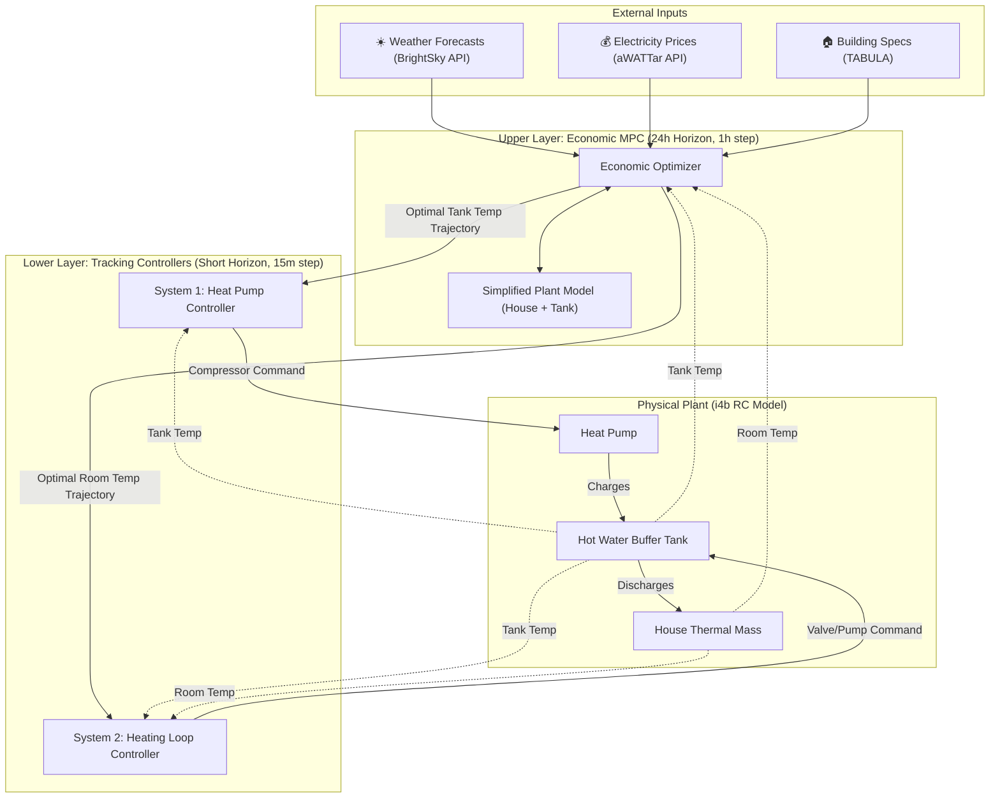

# 🏠 Hierarchical MPC Heat Pump Control System: Detailed Architecture

This document provides a comprehensive technical breakdown of the Hierarchical Model Predictive Control (MPC) based heat pump control system. The architecture utilizes a **two-layer hierarchical control strategy** alongside a **hot water buffer tank (Thermal Energy Storage)** to achieve maximum economic efficiency without compromising occupant comfort.

---

## 1. Executive Summary

A strict decoupling of heat generation and distribution leaves money on the table because the generation side lacks visibility into the true flexibility of the building's thermal mass.

To solve this, our system employs a **Hierarchical (Two-Layer) MPC**:
1.  **Upper Layer (Economic/Supervisory MPC):** Looks at the 24-hour horizon. It takes day-ahead electricity prices (aWATTar) and weather forecasts to determine the absolute cheapest thermal strategy. It outputs an optimal temperature trajectory for the buffer tank and the room.
2.  **Lower Layer (Local/Tracking Control):** Operates on a fast timescale (e.g., every 5-15 minutes). It receives the trajectories from the Upper Layer and controls the physical hardware (compressor, mixing valves) to track those targets, compensating for immediate, unpredicted disturbances (like someone opening a window).

By utilizing a **Buffer Tank**, the system can decouple the *timing* of electricity consumption from the *timing* of heat delivery, storing cheap heat up to an optimal limit where heat loss doesn't outweigh price savings.

---

## 2. System Architecture Diagram

---

## 3. Component Explanation

### 3.1 The Buffer Tank (Thermal Energy Storage)
The hot water tank acts as a thermal battery. 
*   **The Trade-off:** The Upper Layer decides the optimal tank temperature based on outside temperature and price. Heating the tank to 90°C stores immense energy, but the Heat Pump's COP plummets and the tank's standby heat losses spike. The MPC finds the mathematical "sweet spot" where price savings outweigh heat losses.

### 3.2 Upper Layer: Economic MPC
*   **Horizon:** 24 to 48 hours.
*   **Objective:** Strictly minimize electricity costs while respecting thermal bounds.
*   **Mechanism:** Uses a simplified, low-order thermal model of the tank and the house to quickly simulate the whole day. It outputs a "reference trajectory" (e.g., "Heat the tank to 65°C by 4 AM, let the house cool to 20°C, then boost both at 2 PM").

### 3.3 Lower Layer: Tracking Controllers
*   **Horizon:** 1 to 4 hours (or instantaneous PID).
*   **Objective:** Minimize the error between the physical temperatures and the reference trajectories handed down by the Upper Layer.
*   **Mechanism:** Commands the hardware. **System 1** modulates the heat pump to hit the tank trajectory. **System 2** adjusts the mixing valves to draw heat from the tank to hit the room trajectory.

---

## 4. System States

The system state now includes the crucial buffer tank:

| Category | Feature | Explanation |
|---|---|---|
| **Thermal State** | T_room, T_wall, T_ret | Temperatures of the air, wall mass, and return water. |
| **Storage State** | **T_tank** | Current temperature of the hot water buffer tank. |
| **External** | T_amb, Q_gains | Outdoor temperature and internal gains (human/appliance heat). |
| **Market** | Price | Current and predicted electricity cost (€/kWh) from aWATTar. |

---

## 5. Control Variables (Actions)

**Upper Layer Outputs:**
*   $T_{tank}^{ref}(t)$: The reference trajectory for the tank over the next 24 hours.
*   $T_{room}^{ref}(t)$: The reference trajectory for the room.

**Lower Layer Outputs (Hardware Actuation):**
*   $u_{HP}$: Heat pump thermal power input (or compressor frequency).
*   $u_{valve}$: Mixing valve position (controls heat flow from tank to house).

---

## 6. The Objective Functions

**Upper Layer (Cost Minimization):**
$$\min_{T^{ref}} \sum_{k=0}^{N_{long}-1} \left( \text{Price}_k \cdot \frac{Q_{HP,k}}{COP_k(T_{amb}, T_{tank})} + w_{loss} \cdot Q_{loss}(T_{tank}) \right)$$
*Subject to comfort constraints and hardware limits.*

**Lower Layer (Trajectory Tracking):**
$$\min_{u} \sum_{k=0}^{N_{short}-1} \left( \|T_{tank} - T_{tank}^{ref}\|^2 + \|T_{room} - T_{room}^{ref}\|^2 + \lambda \|\Delta u\|^2 \right)$$
*This ensures the hardware tightly follows the economic plan while penalizing aggressive compressor cycling ($\Delta u$).*

---

## 7. Algorithms & Solvers

*   **Upper Layer:** Non-linear programming (NLP) solver like **IPOPT** via CasADi or GEKKO, running every hour to ingest new aWATTar prices and BrightSky weather forecasts.
*   **Lower Layer:** Fast Linear MPC (using OSQP) or advanced PID controllers running every 5-15 minutes.

---

## 8. Conclusion

By implementing a **Hierarchical MPC** centered around a **Buffer Tank**, the architecture achieves optimal economic dispatch. The Economic layer handles the complex calculus of varying electricity prices and dynamic heat losses, while the Tracking layer ensures robust, highly responsive comfort control against unpredictable real-world disturbances.
