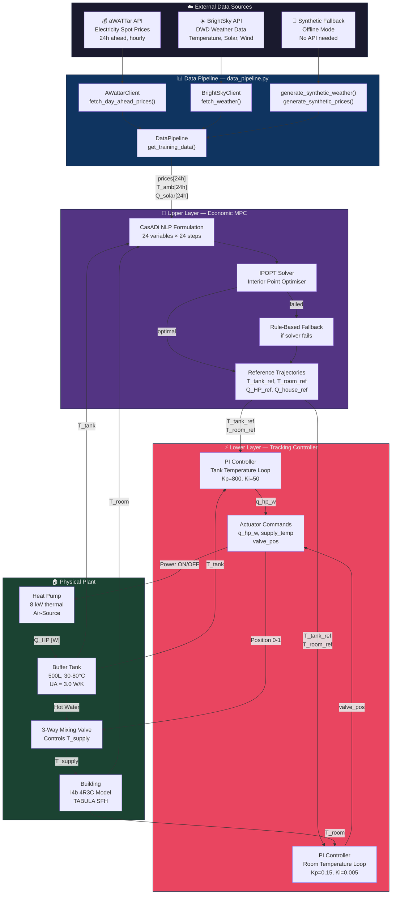
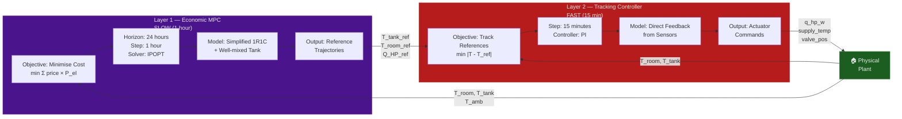
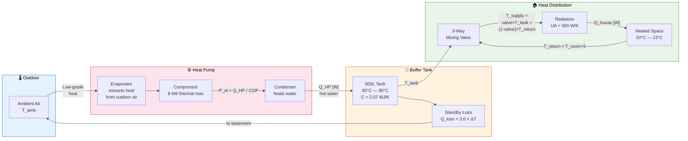
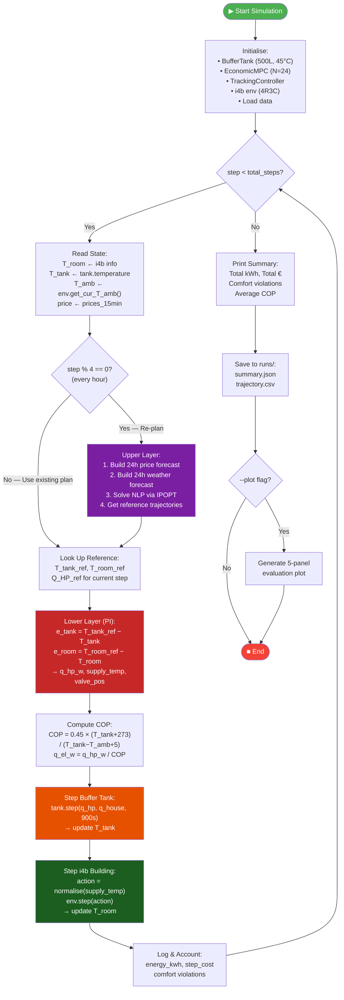
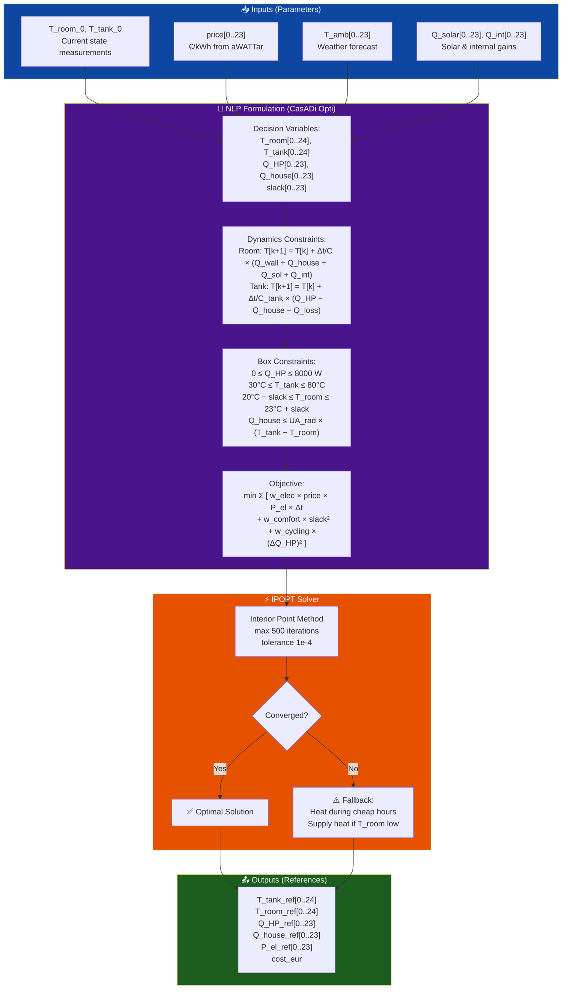
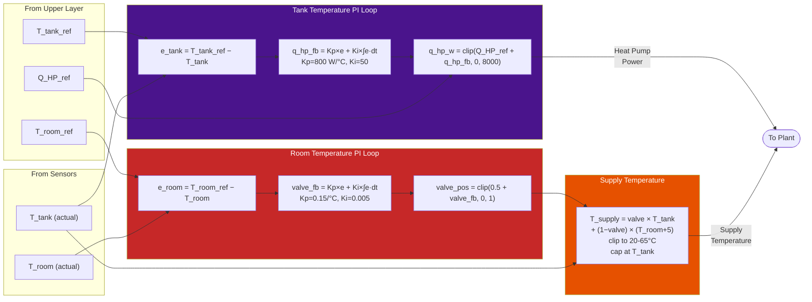
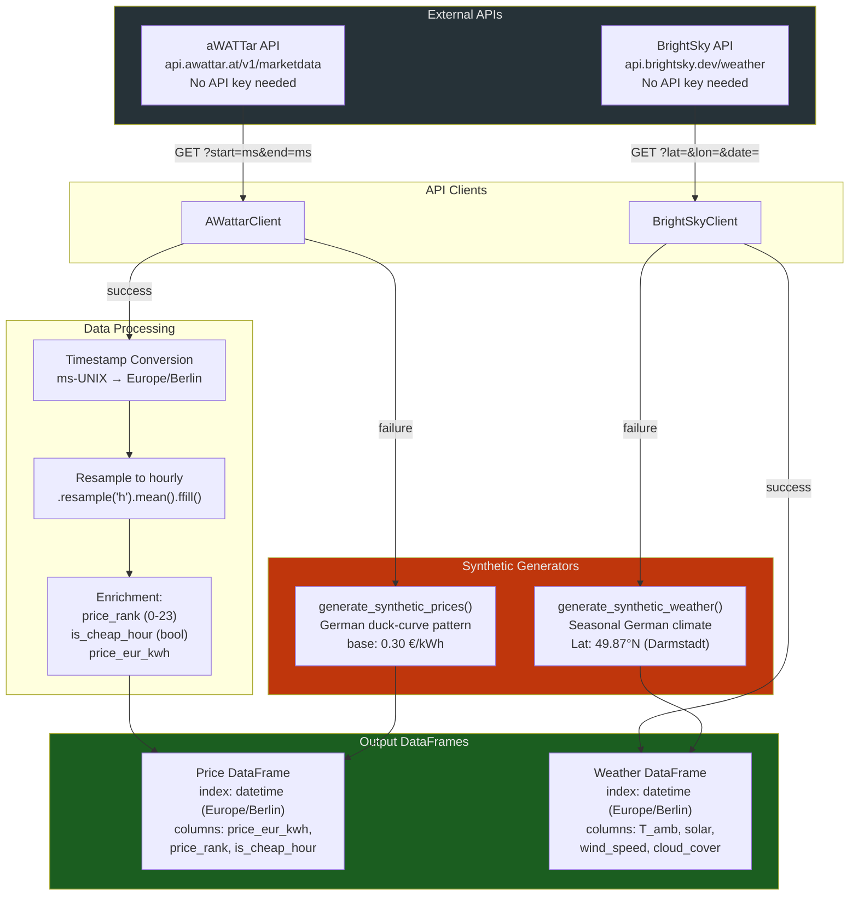
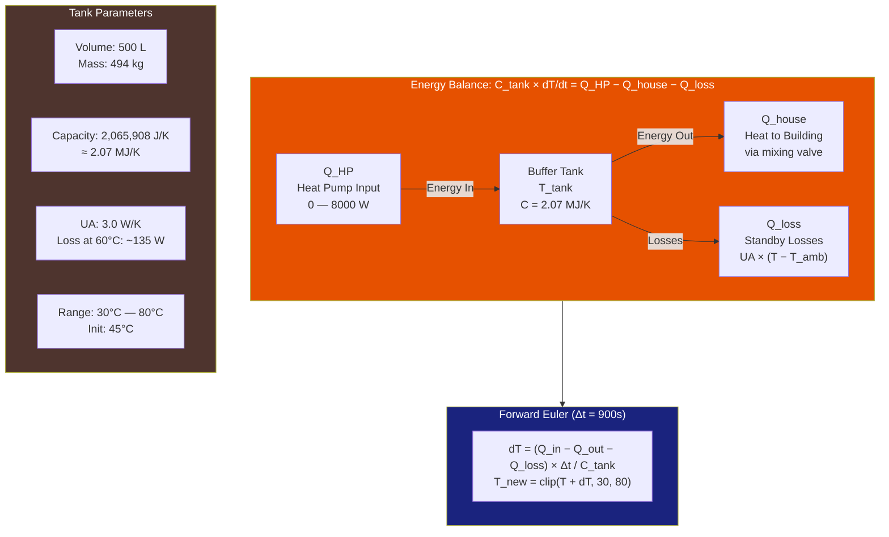
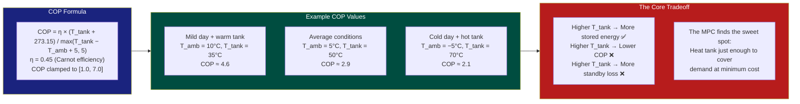
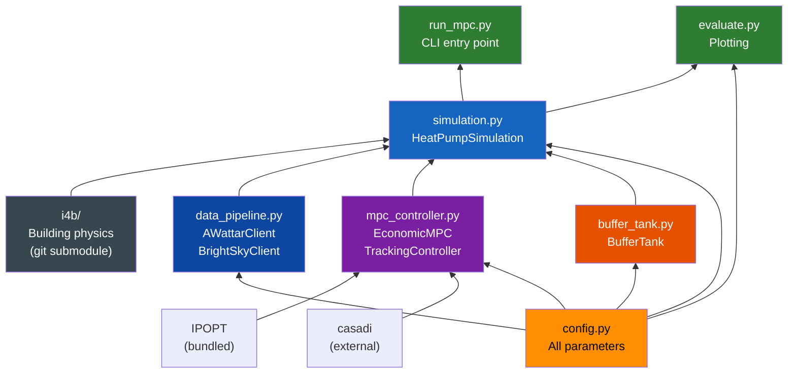

# Technical Diagrams — Hierarchical MPC Heat Pump Controller

> Visual reference for the system architecture, control flows, physics models, and data paths.
> Companion to [ARCHITECTURE.md](ARCHITECTURE.md).

---

## Table of Contents

1. [Full System Architecture](#1-full-system-architecture)
2. [Control Hierarchy](#2-control-hierarchy)
3. [Physical System Schematic](#3-physical-system-schematic)
4. [Simulation Loop Flowchart](#4-simulation-loop-flowchart)
5. [Upper Layer — Economic MPC Detail](#5-upper-layer--economic-mpc-detail)
6. [Lower Layer — Tracking Controller Detail](#6-lower-layer--tracking-controller-detail)
7. [Data Pipeline](#7-data-pipeline)
8. [Buffer Tank Thermal Model](#8-buffer-tank-thermal-model)
9. [COP Behaviour](#9-cop-behaviour)
10. [Module Dependency Graph](#10-module-dependency-graph)
11. [Timing Diagram](#11-timing-diagram)

---

## 1. Full System Architecture



---

## 2. Control Hierarchy



---

## 3. Physical System Schematic



---

## 4. Simulation Loop Flowchart



---

## 5. Upper Layer — Economic MPC Detail



---

## 6. Lower Layer — Tracking Controller Detail



---

## 7. Data Pipeline



---

## 8. Buffer Tank Thermal Model



---

## 9. COP Behaviour

The heat pump COP depends on the temperature lift from ambient air to the tank. Higher tank temperatures and colder ambient air reduce COP, making electricity-to-heat conversion less efficient.



---

## 10. Module Dependency Graph



---

## 11. Timing Diagram

Shows how the two control layers interleave over 2 hours of operation:

```
Time    Upper Layer              Lower Layer              Plant State
─────   ─────────────────────    ─────────────────────    ────────────────────
00:00   ┌─ SOLVE (IPOPT) ──┐
        │  24h NLP          │
        │  N=24 vars        │
        └── plan ready ─────┤
                            ├── Step 1: PI compute ──►   T_room=20.3, T_tank=45
                            │   q_hp=4200W, valve=0.52
00:15                       ├── Step 2: PI compute ──►   T_room=20.5, T_tank=46
                            │   q_hp=3800W, valve=0.48
00:30                       ├── Step 3: PI compute ──►   T_room=20.8, T_tank=47
                            │   q_hp=3100W, valve=0.45
00:45                       ├── Step 4: PI compute ──►   T_room=21.0, T_tank=48
                            │   q_hp=2500W, valve=0.40

01:00   ┌─ RE-SOLVE ───────┐
        │  New prices/weather│
        │  Updated T_room,  │
        │  T_tank from plant│
        └── new plan ───────┤
                            ├── Step 5: PI compute ──►   T_room=21.1, T_tank=49
                            │   q_hp=1800W, valve=0.38
01:15                       ├── Step 6: PI compute ──►   T_room=21.0, T_tank=48
                            │   q_hp=0W, valve=0.35       (cheap hour ended)
01:30                       ├── Step 7: PI compute ──►   T_room=20.8, T_tank=47
                            │   q_hp=0W, valve=0.42       (using stored heat)
01:45                       ├── Step 8: PI compute ──►   T_room=20.6, T_tank=46
                            │   q_hp=0W, valve=0.50       (discharging tank)

02:00   ┌─ RE-SOLVE ───────┐    ...continues...
```

### Key Insight

The upper layer decides *strategy* ("charge now, coast later"), while the lower layer handles *execution* ("maintain 21°C using the stored energy"). The 4:1 step ratio (4 lower steps per upper step) keeps the system responsive without over-solving the economic problem.

---

## Evaluation Output Panels

After a simulation run with `--plot`, the system generates a 5-panel figure:

```
┌──────────────────────────────────────────────────────────────────┐
│  Panel 1: Room Temperature                                       │
│  • Blue solid: T_room actual    • Blue dashed: T_room MPC ref    │
│  • Orange: T_ambient            • Green band: comfort zone       │
├──────────────────────────────────────────────────────────────────┤
│  Panel 2: Tank Temperature                                       │
│  • Pink solid: T_tank actual    • Pink dashed: T_tank MPC ref    │
├──────────────────────────────────────────────────────────────────┤
│  Panel 3: HP Power & Valve                                       │
│  • Purple fill: HP thermal kW   • Cyan line: valve position      │
├──────────────────────────────────────────────────────────────────┤
│  Panel 4: Price & Energy                                         │
│  • Red line: €/kWh price        • Blue bars: electrical kWh      │
├──────────────────────────────────────────────────────────────────┤
│  Panel 5: COP & Cost                                             │
│  • Brown line: COP              • Green fill: cumulative €       │
└──────────────────────────────────────────────────────────────────┘
```
